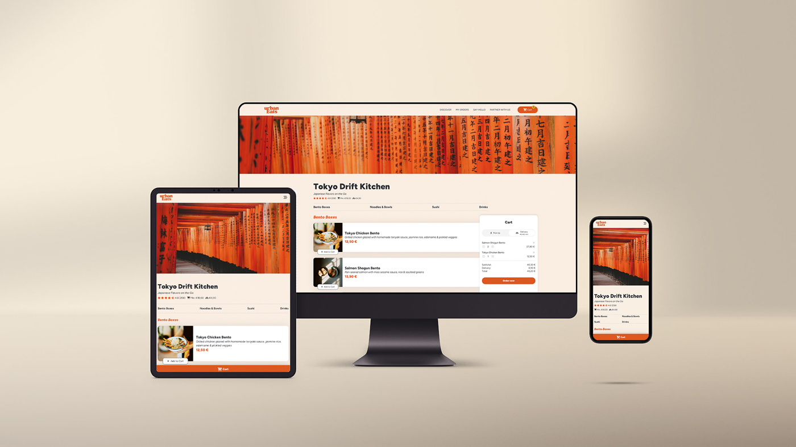

# URBANEATS – MODERN FOOD DELIVERY APP

## Overview

**UrbanEats** is a dynamic, interactive food ordering platform built with **Vanilla JavaScript, HTML5, and CSS3**. Inspired by modern delivery services, it allows users to browse a diverse menu, manage a real-time shopping cart, and toggle between delivery and pickup options with instant price recalculations.

This project was developed as a key milestone during my **Front-End Development training at Developer Akademie**, focusing on dynamic DOM manipulation and persistent data handling.

### Preview

### Live Demo

- **Link:** [View Live Project](https://stefanstraeter.github.io/urban-eats/)

---

## Technical Architecture

The application follows a clean separation of concerns by splitting the logic into specialized script files and modular CSS:

### Project Structure

- **`scripts/db.js`**: The "Data Engine" containing the complex dish objects, categories, and prices.
- **`scripts/template.js`**: Pure UI functions that return HTML strings for dynamic rendering.
- **`script.js`**: The main controller handling the shopping cart logic, Local Storage synchronization, and event listeners.
- **`styles/`**: Modular CSS architecture with a dedicated reset, component-based styling, and a mobile-first grid system.

---

## Key Features & Implementation

### Dynamic Menu & State Management

Instead of static HTML, the entire menu is rendered dynamically from a central database. This ensures that any changes to prices or ingredients in `db.js` are instantly reflected across the entire UI.

### Advanced Cart Logic

- **Real-time Calculation**: The app monitors subtotals, service fees, and delivery costs. The "Delivery vs. Pickup" toggle dynamically adds or removes fees.
- **Persistence**: Integrated **Local Storage** ensures that the user's selection remains intact even after a page reload.
- **Validation**: Logic to handle minimum order values and quantity updates (+/-) within the cart.

### Mobile-First & Responsive UX

The interface was designed with a mobile-first workflow, ensuring a seamless experience on smartphones before scaling up to desktop:

- **Sticky Cart**: An optimized cart visibility strategy for small screens.
- **Modern CSS**: Extensive use of Flexbox and CSS Grid for a robust, fluid layout.
- **Visual Feedback**: Hover effects and active states to guide the user through the ordering process.

### Clean Code & Templates

By using a **Template-String Pattern**, the project keeps HTML and JavaScript logic separated, making the code more readable and easier to debug.

---

## Getting Started

1. **Clone the repository:** `git clone https://github.com/stefanstraeter/urban-eats`
2. **Launch:** Open `index.html` via a local server (e.g., VS Code Live Server).
3. **Usage:** Browse categories, add items to your cart, and test the delivery/pickup toggle to see real-time price updates.

---

## Author

**Stefan Straeter** _Full Stack Developer_

- GitHub: [@stefanstraeter](https://github.com/stefanstraeter/)
